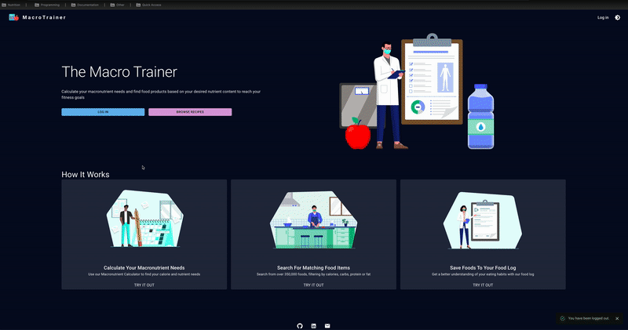
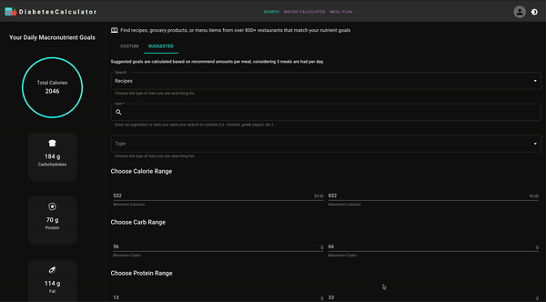
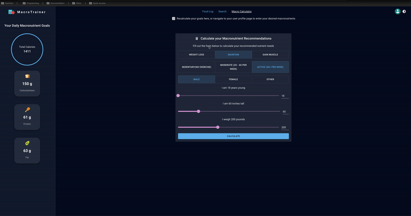

# Nutrition Toolkit

A full-stack food logging application that allows users to calculate their recommended calories and macronutrient needs based on their metrics. They can then search from a list of over 350,000 foods to find any that match their desired macronutrient ranges.

## Live Link

View live deployment here at [nutritiontoolkit.com](https://nutritiontoolkit.com) or see the demo below.

## Features & Usage

- create account with username, email, password or sign in using Google
- Enter height, weight, age, gender, fitness goals and activity level to calculate your total daily recommended calories, carbohydrates, protein, and fat
- Save your favorite food items to your own personal food log
- Search for food items with any custom nutrient ranges
- Edit your recommended nutrient ranges by using the Macronutrient Calculator again or simply entering your preferred nutrient ranges
- Dark and light modes are available for preferred viewing option. User's preferred viewing option is then saved to local storage for their next visit.

## Demo





## Tech Stack

This project was built with the following technologies:

[](https://shields.io/)
[](https://shields.io/)
[](https://shields.io/)
[](https://shields.io/)
[](https://shields.io/)
[](https://shields.io/)
[](https://shields.io/)
[](https://shields.io/)
[](https://shields.io/)
[](https://shields.io/)
[](https://shields.io/)
[](https://shields.io/)
[](https://shields.io/)
[](https://shields.io/)
[](https://shields.io/)

## Installation & Development

- Clone this repository and navigate to project directory in the terminal

- Install necessary dependencies:

```bash
npm install
```

- To allow code-splitting to work when building files, must first change tsconfig.json 'module' variable to 'esnext'. Feel free to change back to 'commonjs' after building files to avoid errors with using import statements instead of require statements for modules.

- use sample.env to create .env file

### Set up pre commit hooks

- Husky and lint-staged have been included as dev dependencies. After install the prepare script in package.json will run, which installs Git hooks into the .git/hooks folder. After this, commits should run the pre-commit hook defined in .husky/pre-commit, which is the following command:

```bash
npx lint-staged
```

This runs the lint-staged block defined in the package.json.

```bash
npx husky init
```

This will create the .husky folder

### Set up postgreSQL database

- Install postgresl

```bash
brew install postgresql
sudo apt install postgresql
```

- Make sure service is running:

```bash
brew services start postgresql
sudo systemctl start postgresql
```

- create new role called cristian (postgres uses current user for peer authentication so make sure you are logged in as cristian when connecting)

```bash
sudo -u postgres psql
create database nutrition_toolkit;
create database nutrition_toolkit_test;
create role cristian with login;
```

- login as cristian if not already done so and then connect

```bash
su - cristian
psql postgres
\l # list databases
\c nutrition_toolkit # connect to database
\dt # list all tables
```

- create backup if needed

```bash
pg_dump -U cristian -d nutrition_toolkit_dev > ~/Workspace/the_macro_trainer.sql
```

- restore from backup

```bash
psql -U cristian -d nutrition_toolkit < ~/nutritionToolkit.sql
```

### Set up Google Sign in

- Make sure application is configured on [Google dev console][google-dev] by following [these steps][register-google]

### Set up email service

- Update following variables in .env:

```bash
GMAIL_OAUTH_CLIENT_ID
GMAIL_OAUTH_CLIENT_SECRET
EMAIL_USERNAME
GMAIL_REFRESH_TOKEN
```

- Create new client on google cloud console with following redirect URL:

```text
https://developers.google.com/oauthplayground
```

- Enable the Gmail API on the google cloud project

- Use google playground to generate refresh token manually by scrolling to Gmail API v1 and selecting <https://mail.google.com/> and enter the client ID and client secret to create new refresh token. Add this to the .env file as GMAIL_REFRESH_TOKEN.

### Start application

- Use tsx to start server and use weback dev server to serve frontend static files:

```bash
npm run dev
```

- All data was retrieved from CSV files provided by USDA and imported into RDS PostgreSQL database.

- Note that branded foods use the nutrient_nbr field in the nutrient table as a foreign key for nutrition, while other data types use the nutrient id

## Testing

- Make sure test database is created before running test suite

```bash
createdb nutrition_toolkit_test
```

- Run unit tests with Jest/React Testing Library:

```bash
npm run test:jest
```

-Then run end to end tests with Cypress:

```bash
npm run test:cypress
```

-Or run both tests concurrently:

```bash
npm run test
```

## Deployment

- Use docker to build image. Dockerfile is split into two stages: one for build the artifact, and the second will copy the built artifact from the previous stage into this new stage so that none of the build tools required to build the application are included in the final image.

```bash
docker build -t nutrition-toolkit-image .
```

- Run the image passing in the .env file as an argument to the running container:

```bash
docker run --env DATABASE_HOST=host.docker.internal --add-host=host.docker.internal:host-gateway --rm -it --env-file .env -p 8080:8080 --name nutrition-toolkit nutrition-toolkit-image
```

NOTE: --rm will automatically remove the container when it exists, -i keeps STDIN open so you can interact with the container and -t allocates a pseudo terminal to get a normal shell experience

- To run the image on production, use the following command:

```bash
docker run -d --env DATABASE_HOST=host.docker.internal --add-host=host.docker.internal:host-gateway --env-file .env -p 8080:8080 --name nutrition-toolkit nutrition-toolkit-image
```

NOTE: you must delete and rerun the container when changes are made

- To view logs, use this command:

```bash
docker logs nutrition-toolkit
```

## Droplet Setup

- ssh into digital ocean droplet

```bash
ssh -i ~/.ssh/id_digital_ocean root@64.227.17.191
```

- create new user

```bash
sudo adduser cristian
```

- login as new user

```bash
su - cristian
```

- Make sure .env file exists and most recent version is available on droplet

- And also restart Nginx

```bash
sudo systemctl restart nginx
```

Then navigate to port 8080 in your browser to view your application.

## Docker Setup

- Ubuntu firewall defaults to denying forwarded traffic, which causes an issue with Docker as manipulates iptables directly. The docker bridge network connects to each container through a virtual Ethernet pair. Since the container has different IP than PostgreSQL database running locally (not local traffic of 127.0.0.1) then firewall rules block this request. To allow run the following command:

```bash
sudo ufw allow from 172.17.0.0/16 to any port 5432
```

- In the /etc/postgresql/16/main/postgresql.conf add the following line:

```bash
listen_addresses = '*'      
```

- Add the following to /etc/postgresql/16/main/pg_hba.conf:

```bash
host    all    all    172.17.0.0/16    scram-sha-256
```

## Resources

- [React code-splitting][react]
- [Intersection Observer API][insersection]
- [Set up tests with Jest and Supertest][jest]
- [Set up users for PostgreSQL][pgsql]
- [Fixing issues with setting up PostgreSQL on RDS][rds]
- [Getting correct permissions to tables for requests sent from EC2 instance][ec2]
- [Setting up custom domain when using Nginx][nginx]
- [Passport node.js][passport]
- [Google Dev Console][google-dev]
- [Digital Ocean Droplet][digital-ocean]
- [Deploy on droplet][digital-ocean-deploy]
- [Install Docker on Ubuntu][digital-ocean-docker]

[passport]: https://www.passportjs.org/packages/passport-google-oauth20/
[react]: https://reactjs.org/docs/code-splitting.html
[insersection]: https://developer.mozilla.org/en-US/docs/Web/API/Intersection_Observer_API
[jest]: https://www.rithmschool.com/courses/intermediate-node-express/api-tests-with-jest
[pgsql]: https://stackoverflow.com/questions/42749033/fatal-password-authentication-failed-for-user-root-postgresql
[rds]: https://stackoverflow.com/questions/65877048/pgadmin-on-ubuntu-20-04-fatal-password-authentication-failed-for-user
[ec2]: https://stackoverflow.com/questions/55080121/amazon-rds-postgresql-role-cannot-access-tables
[nginx]: https://stackoverflow.com/questions/32467541/link-a-google-domain-to-amazon-ec2-server#:~:text=In%20your%20google%20domain%20admin,from%20the%20amazon%20EC2%20instance.
[google-dev]: https://console.cloud.google.com/welcome?project=macrotrainer
[register-google]: https://www.passportjs.org/tutorials/google/register/
[digital-ocean]: https://cloud.digitalocean.com/droplets/577653788?i=5ac0da
[digital-ocean-deploy]: https://www.digitalocean.com/community/tutorials/how-to-set-up-a-node-js-application-for-production-on-ubuntu-20-04
[digital-ocean-docker]: https://www.digitalocean.com/community/tutorials/how-to-install-and-use-docker-on-ubuntu-20-04
